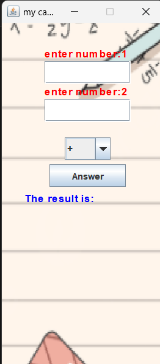

# Java GUI Calculator

A basic calculator application with a modern-looking GUI built using **Java Swing**, and a backend computation engine written in **C**, integrated with the frontend.

---

## Screenshot




---

## Technologies Used

- Java (Swing GUI)
- C (Backend logic)
- VS Code
- MinGW (for compiling C)
- Git & GitHub

---

## Features

- Basic arithmetic operations: +, –, ×, ÷
- Combo box to choose operation
- Styled UI with custom fonts and images
- Background image integration
- Java + C hybrid logic

---

## How to Run

### 1. Compile Backend (C)

```bash
gcc calc.c -o calc.exe
